# Castify Architecture Documentation

## Table of Contents

1. [Overview](#overview)
2. [Technology Stack](#technology-stack)
3. [Directory Structure](#directory-structure)
4. [Core Components](#core-components)
5. [Data Flow](#data-flow)
6. [Module Interactions](#module-interactions)
7. [Key Dependencies](#key-dependencies)
8. [Design Patterns](#design-patterns)
9. [Platform-Specific Implementations](#platform-specific-implementations)
10. [Configuration and Build](#configuration-and-build)

---

## Overview

Castify is a cross-platform screen casting application built in Rust that enables real-time screen and audio streaming between devices. The application supports both **Caster** (sender) and **Receiver** modes, allowing users to broadcast their screen or receive remote streams.

### Key Features

- **Real-time Screen Capture**: Hardware-accelerated screen capture using platform-native APIs
- **Audio Streaming**: Synchronized audio capture and playback using Opus codec
- **WebRTC Communication**: Low-latency peer-to-peer streaming via WebRTC
- **Cross-Platform Support**: Windows (WGC), macOS (ScreenCaptureKit), and Linux
- **Modern GUI**: Built with Iced, a cross-platform GUI framework
- **mDNS Discovery**: Automatic peer discovery on local networks
- **Stream Recording**: Save incoming streams to MP4/MKV/MOV files

### Application Modes

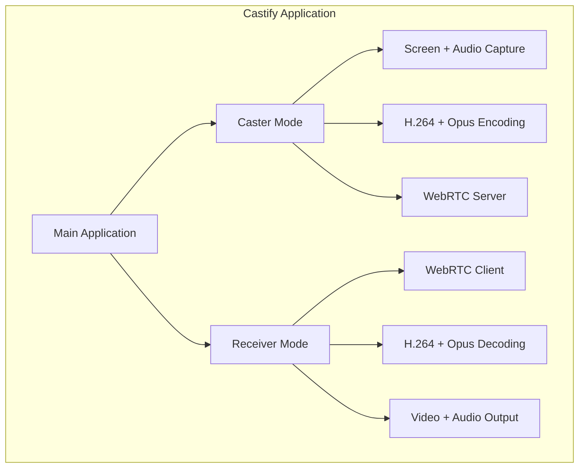

---

## Technology Stack

### Core Technologies

| Category | Technology | Purpose |
|----------|------------|---------|
| Language | Rust 2024 Edition | Primary development language |
| GUI Framework | Iced 0.14 | Cross-platform declarative GUI |
| Rendering | wgpu | GPU-accelerated rendering |
| Async Runtime | Tokio | Async I/O and task management |
| Media Codec | FFmpeg (ac-ffmpeg) | Video/Audio encoding and decoding |
| Networking | WebRTC-rs | Peer-to-peer communication |
| Audio | cpal | Cross-platform audio I/O |

### Platform-Specific Technologies

| Platform | Screen Capture | Additional |
|----------|----------------|------------|
| Windows | Windows Graphics Capture (WGC) | Direct3D 11, DXGI |
| macOS | ScreenCaptureKit | CoreMedia, AVFoundation |
| Linux | (Planned) X11/Wayland | GTK3 |

### Build Tools

- **Cargo**: Package manager and build system
- **winresource**: Windows resource embedding (icons, metadata)
- **packager**: Cross-platform package generation (MSI, DEB, DMG)

---

## Core Components

### 1. Capture Module (`src/capture/`)

The capture module provides platform-abstracted screen and audio capture functionality.

#### ScreenCapture Trait

```rust
#[async_trait]
pub trait ScreenCapture {
    fn new_default() -> Result<ScreenCaptureImpl, anyhow::Error>;
    fn display(&self) -> &dyn DisplayInfo;
    async fn start_capture(
        &mut self,
        encoder: FfmpegEncoder,
        output: tokio::sync::mpsc::Sender<bytes::Bytes>,
        opts_rx: watch::Receiver<CaptureOpts>,
    ) -> Result<(), anyhow::Error>;
    async fn stop_capture(&mut self) -> Result<(), anyhow::Error>;
}
```

#### Platform Implementations

- **Windows**: Uses Windows Graphics Capture (WGC) API via `WGCScreenCapture`
  - Captures frames as D3D11 textures
  - Converts BGRA to NV12 using GPU shaders
  - Supports display selection and crop regions

- **macOS**: Uses ScreenCaptureKit via `MacOSCapture`
  - Native screen recording API
  - Built-in audio capture support

#### Capture State Machine

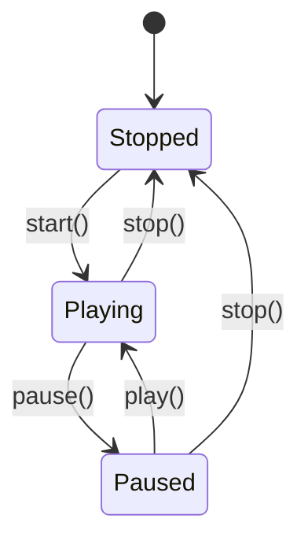

### 2. Encoder Module (`src/encoder/`)

The encoder module handles H.264 video encoding with hardware acceleration fallback.

#### Encoder Chain (Priority Order)

1. **h264_nvenc** - NVIDIA GPU encoding (fastest)
2. **h264_qsv** - Intel Quick Sync Video
3. **h264_amf** - AMD AMF
4. **libx264** - CPU fallback (always available)

#### Encoding Parameters

```rust
const ENCODER_CHAIN: &[(&str, &[(&str, &str)])] = &[
    ("h264_nvenc", &[
        ("preset", "p1"),        // Lowest latency
        ("tune", "ull"),         // Ultra-low latency
        ("rc", "vbr"),           // Variable bitrate
        ("b", "800000"),         // 800 Kbps target
        ("maxrate", "1200000"),  // 1.2 Mbps max
        ("g", "60"),             // 2-second GOP
    ]),
    // ... other encoders
];
```

### 3. Decoder Module (`src/decoder/`)

The decoder module handles H.264 video and Opus audio decoding.

#### Components

- **FfmpegDecoder**: H.264 decoding to YUV420p
- **H264Depacketizer**: RTP packet reassembly (RFC 6184)
  - Handles Single NAL, STAP-A, and FU-A packets
  - Waits for IDR frame before outputting

- **AudioPlayer**: Opus decoding and playback via cpal

### 4. Pipeline Module (`src/pipeline/`)

The pipeline module provides a stage-based media processing architecture.

#### Pipeline Architecture

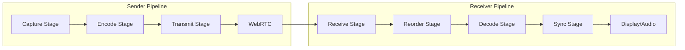

#### PipelineStage Trait

```rust
#[async_trait]
pub trait PipelineStage: Send + Sync {
    async fn run(&mut self) -> Result<()>;
    fn name(&self) -> &'static str;
    async fn shutdown(&mut self) -> Result<()>;
}
```

#### Pipeline State Machine

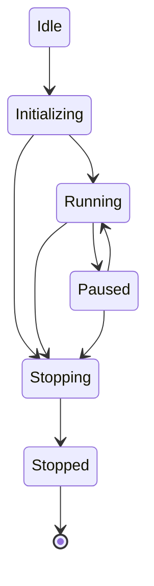

### 5. GUI Module (`src/gui/`)

The GUI module implements the user interface using the Iced framework.

#### Application Structure

```rust
pub struct App {
    pub config: Config,
    windows: Windows,
    tray_icon: Option<TrayIcon>,
}
```

#### Window Types

- **Main**: Primary application window
- **AreaSelector**: Fullscreen crop region selection
- **Annotation**: Fullscreen annotation overlay

#### Event Flow

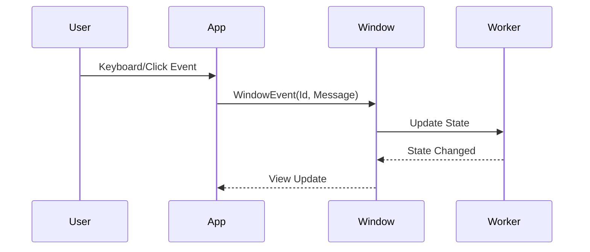

### 6. WebRTC Module (`src/utils/net/webrtc/`)

The WebRTC module handles peer-to-peer communication.

#### Components

- **WebRTCServer**: Accepts incoming connections, manages peers
- **WebRTCReceiver**: Connects to casters, receives streams
- **WRTCPeer**: Individual peer connection management
- **WebRTCCaster**: Broadcasts to multiple peers

#### Signaling Flow

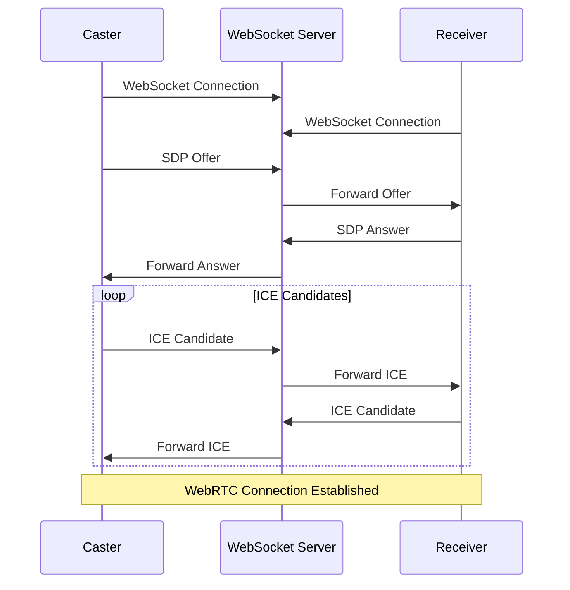

---

## Data Flow

### Sender (Caster) Data Flow

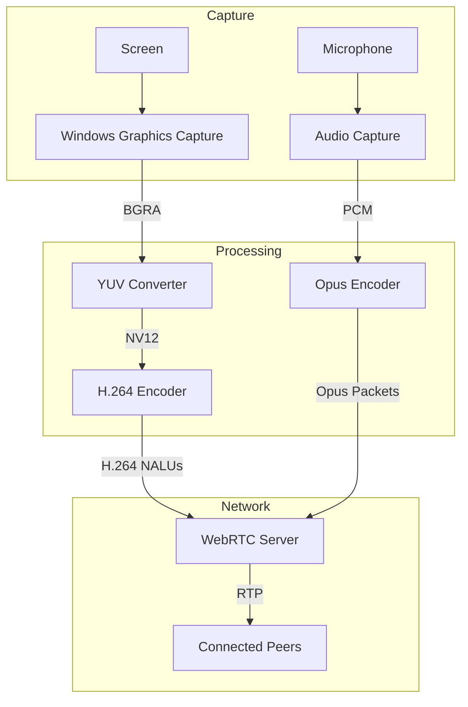

### Receiver Data Flow

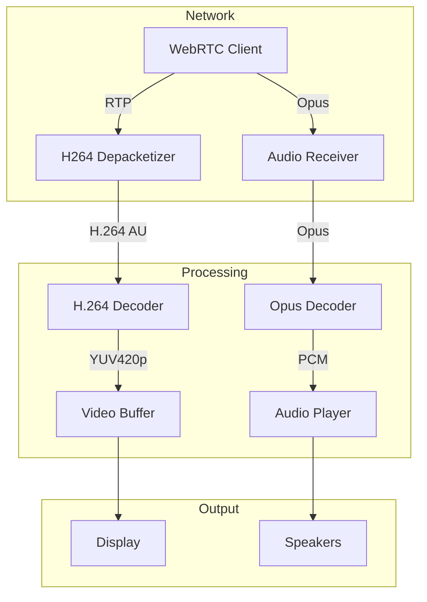

---

## Module Interactions

### Startup Sequence

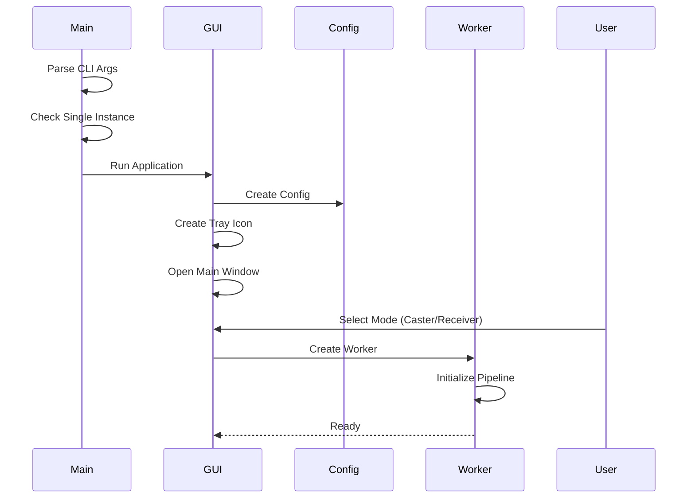

### Caster Mode Interaction

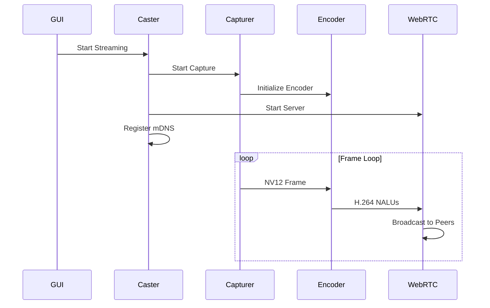

### Receiver Mode Interaction

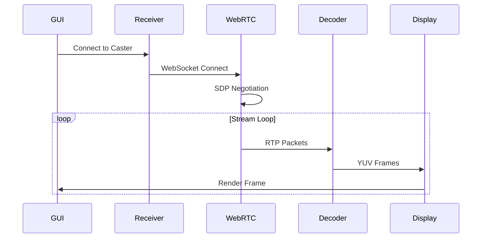

---

## Key Dependencies

### Media Processing

| Crate | Version | Purpose |
|-------|---------|---------|
| ac-ffmpeg | 0.19.0 | FFmpeg bindings for encoding/decoding |
| cpal | 0.17.3 | Cross-platform audio I/O |

### Networking

| Crate | Version | Purpose |
|-------|---------|---------|
| webrtc | 0.17.1 | WebRTC implementation |
| async-tungstenite | 0.33.0 | WebSocket (signaling) |
| mdns-sd | 0.18.0 | mDNS service discovery |
| natpmp | 0.5.0 | NAT port mapping |

### GUI

| Crate | Version | Purpose |
|-------|---------|---------|
| iced | 0.14.0 | GUI framework |
| iced_wgpu | 0.14.0 | wgpu backend |
| iced_anim | 0.3.1 | Animation support |

### System Integration

| Crate | Version | Purpose |
|-------|---------|---------|
| interprocess | 2.3.1 | Single-instance lock |
| tray-icon | 0.21.3 | System tray |
| rdev | 0.5.3 | Global hotkey listening |
| native-dialog | 0.9.6 | Native file dialogs |

### Windows-Specific

| Crate | Version | Purpose |
|-------|---------|---------|
| windows | 0.62.2 | Win32 API bindings |

---

## Design Patterns

### 1. Trait-Based Abstraction

Platform-specific implementations are abstracted behind traits:

```rust
pub trait ScreenCapture { ... }
pub trait DisplayInfo { ... }
pub trait DisplaySelector { ... }
```

### 2. State Machine Pattern

Used extensively for managing component lifecycle:

- `CaptureState`: Playing, Paused, Stopped
- `PipelineState`: Idle, Initializing, Running, Paused, Stopping, Stopped

### 3. Channel-Based Communication

Components communicate via Tokio channels:

- `mpsc`: Multi-producer, single-consumer for data streams
- `watch`: Single-value broadcast for configuration updates
- `broadcast`: Multi-consumer for events

### 4. Coordinator Pattern

Pipeline stages are orchestrated by coordinators:

```rust
pub struct SenderCoordinator {
    capture_stage: CaptureStage,
    clock: MediaClock,
    health: Arc<PipelineHealth>,
    state: PipelineState,
    server: Arc<WebRTCServer>,
}
```

### 5. Builder Pattern

Used for constructing complex objects:

```rust
VideoEncoder::builder("h264_nvenc")
    .pixel_format(pixel_format)
    .width(w)
    .height(h)
    .time_base(time_base)
    .set_option("preset", "p1")
    .build()
```

### 6. Observer Pattern

Health monitoring uses observer-style alerts:

```rust
pub enum HealthAlert {
    Stalled { duration: Duration },
    HighDropRate { rate: f64 },
    DecodeFailures { count: u64 },
    NetworkErrors { count: u64 },
}
```

### 7. RAII Pattern

Resources are managed through Rust's ownership system:

```rust
impl Drop for WRTCPeer {
    fn drop(&mut self) {
        block_on(async move {
            self.disconnect().await;
        })
    }
}
```

---

## Platform-Specific Implementations

### Windows (WGC)

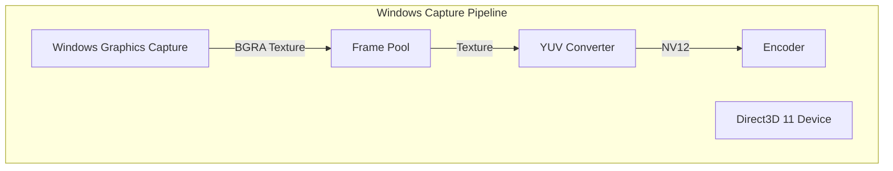

Key components:
- `Direct3D11CaptureFramePool`: Frame buffering
- `GraphicsCaptureSession`: Capture control
- `YuvConverter`: GPU-accelerated color conversion

### macOS (ScreenCaptureKit)

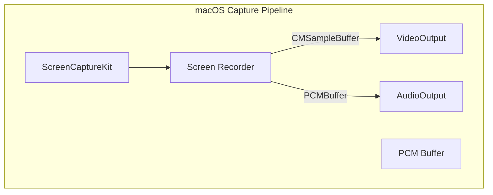

---

## Configuration and Build

### Build Process

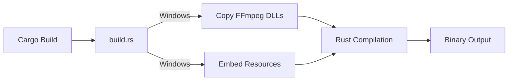

### CLI Arguments

```bash
castify                    # Normal startup (single instance)
castify --multi yes        # Allow multiple instances
castify --version          # Show version
castify --help             # Show help
```

### Environment Variables

- `WGPU_BACKEND`: Force specific GPU backend (vulkan, dx12, metal)

### Package Formats

| Platform | Format |
|----------|--------|
| Windows | MSI (WiX) |
| macOS | DMG |
| Linux | DEB, Pacman |

---

## Performance Considerations

### Video Pipeline

1. **Zero-Copy Where Possible**: GPU textures stay on GPU until encoding
2. **Frame Pooling**: Reuse frame buffers to reduce allocations
3. **Adaptive Bitrate**: Encoder adjusts to network conditions
4. **Hardware Acceleration**: Prefer GPU encoders (NVENC, QSV, AMF)

### Audio Pipeline

1. **Low-Latency Opus**: 10ms frame duration
2. **Ring Buffers**: Prevent audio dropouts
3. **Async Processing**: Audio runs in separate task

### Network

1. **WebRTC**: UDP-based, low latency
2. **Trickle ICE**: Progressive candidate gathering
3. **PLI/FIR Handling**: Request keyframes on packet loss

---

## Error Handling

### Strategy

- **Result Types**: Extensive use of `Result<T, anyhow::Error>`
- **Graceful Degradation**: Fallback to software encoder if hardware fails
- **Health Monitoring**: Track and report pipeline issues
- **Panic Handling**: Custom panic hook for clean shutdown

### Recovery Mechanisms

1. **Encoder Fallback Chain**: Try hardware encoders, fall back to libx264
2. **Decoder Reset**: Reset depacketizer on consecutive failures
3. **Peer Reconnection**: WebRTC handles connection state changes
4. **IDR Request**: Request keyframe on decode errors

---

## Security Considerations

1. **Local Network Only**: mDNS discovery limited to local network
2. **No Encryption**: WebRTC uses default SRTP (secure RTP)
3. **Single Instance**: Prevents multiple conflicting instances
4. **No Authentication**: Designed for trusted local networks

---

## Future Improvements

1. **Linux Support**: Complete X11/Wayland capture implementation
2. **Recording on Caster**: Add local recording capability
3. **Multi-Monitor Selection**: Enhanced display management
4. **Quality Settings**: User-configurable bitrate/quality
5. **Remote Connections**: STUN/TURN server support for remote streaming

---

*This documentation was generated from source code analysis. Last updated: 2026-02-24*
