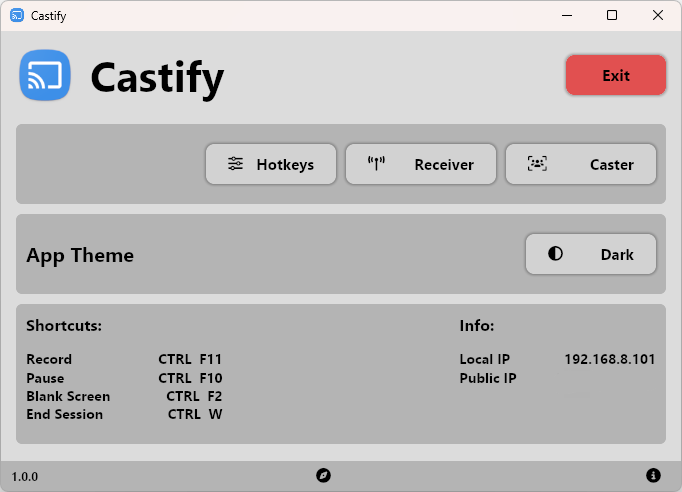

# Castify

<div align="center">


**A cross-platform screen casting application built in Rust**

[](LICENSE)
[](https://www.rust-lang.org/)
[](https://github.com/sh1zen/Castify)

[Features](#-features) • [Installation](#-installation) • [Usage](#-usage) • [Building](#-building-from-source) • [Architecture](./ARCHITECTURE.md)

</div>

---



## 📖 Overview

Castify enables real-time screen and audio streaming between devices on your local network. It operates in two modes:

- **Caster Mode**: Broadcast your screen (with optional audio) to connected receivers
- **Receiver Mode**: Connect to a caster and view their stream in real-time

The application uses WebRTC for low-latency peer-to-peer communication and hardware-accelerated video encoding when available.

## ✨ Features

### Core Features
- 🖥️ **Screen Capture** - Full screen or cropped region capture
- 🔊 **Audio Streaming** - Synchronized audio capture and playback (Opus codec)
- 🌐 **WebRTC Streaming** - Low-latency peer-to-peer communication
- 📺 **Multi-Monitor Support** - Select which display to capture
- 🔍 **Auto-Discovery** - mDNS-based caster discovery on local networks

### User Interface
- 🎨 **Modern GUI** - Clean, minimalistic interface built with Iced
- ⌨️ **Global Hotkeys** - Customizable keyboard shortcuts
- 📍 **System Tray** - Background operation with tray icon
- 🎯 **Area Selection** - Visual crop region selection overlay

### Technical Features
- ⚡ **Hardware Encoding** - NVENC, QSV, AMF support with CPU fallback
- 🔄 **Adaptive Bitrate** - Adjusts to network conditions
- 📹 **Stream Recording** - Save incoming streams to MP4/MKV/MOV
- 🔒 **Single Instance** - Prevents conflicting multiple instances

## 📥 Installation

### Pre-built Packages

Download the latest release for your platform from the [Releases](https://github.com/sh1zen/Castify/releases) page:

| Platform | Format |
|----------|--------|
| Windows | MSI installer |
| macOS | DMG image |
| Linux | DEB / Pacman package |

### From Source

```bash
# Clone the repository
git clone https://github.com/sh1zen/Castify.git
cd Castify

# Build and run
cargo build --release
cargo run --release
```

### Using Cargo

```bash
cargo install --git https://github.com/sh1zen/Castify
```

## 📋 Requirements

### Windows
- Windows 10 version 1903 or later (required for Windows Graphics Capture)
- FFmpeg libraries (included in releases)

### macOS
- macOS 10.13 or later
- Grant **Screen Recording** permission: System Preferences → Privacy & Security → Screen Recording
- Grant **Accessibility** permission for global hotkeys: System Preferences → Privacy & Security → Accessibility

### Linux
- GTK3 development libraries: `apt install libgtk-3-dev`
- xdotool: `apt install xdotool`

## 🚀 Usage

### Starting the Application

```bash
# Normal start (single instance mode)
castify

# Allow multiple instances
castify --multi yes

# Show version
castify --version
```

### Caster Mode

1. Launch Castify and select **"Start Casting"**
2. Choose the display to capture (if multiple monitors)
3. Optionally select a crop region using the area selector
4. Share your connection details with receivers:
   - **Auto-discovery**: Receivers on the same network can find you automatically
   - **Manual connection**: Share the displayed IP address and port

### Receiver Mode

1. Launch Castify and select **"Connect to Caster"**
2. Choose connection method:
   - **Auto-discover**: Automatically finds casters on the network
   - **Manual**: Enter the caster's IP address
3. View the incoming stream
4. Optionally record the stream using the save button

### Keyboard Shortcuts

| Action | Default Shortcut |
|--------|------------------|
| Pause/Resume | `Ctrl + F10` |
| Start/Stop Recording | `Ctrl + F11` |
| Blank Screen | `Ctrl + F2` |
| End Session | `Ctrl + W` |

*Shortcuts can be customized in the settings.*

## 🔧 Building from Source

### Prerequisites

1. **Rust Toolchain**
   ```bash
   curl --proto '=https' --tlsv1.2 -sSf https://sh.rustup.rs | sh
   ```

2. **FFmpeg Development Libraries**
   
   **Windows:**
   - Download FFmpeg shared libraries
   - Place in `third_party/ffmpeg/bin/` directory
   
   **macOS:**
   ```bash
   brew install ffmpeg
   ```
   
   **Linux:**
   ```bash
   # Ubuntu/Debian
   sudo apt install ffmpeg libavcodec-dev libavformat-dev libavutil-dev
   
   # Arch Linux
   sudo pacman -S ffmpeg
   ```

### Build Commands

```bash
# Debug build
cargo build

# Release build (optimized)
cargo build --release

# Create packages
cargo build --release
# Packages will be in target/packages/
```

### Environment Variables

| Variable | Description |
|----------|-------------|
| `WGPU_BACKEND` | Force specific GPU backend (`vulkan`, `dx12`, `metal`) |

## 🏗️ Architecture

For a detailed technical overview of the codebase, see [ARCHITECTURE.md](./ARCHITECTURE.md).

### Technology Stack

| Component | Technology |
|-----------|------------|
| GUI Framework | Iced 0.14 |
| Async Runtime | Tokio |
| Video Codec | H.264 (FFmpeg) |
| Audio Codec | Opus |
| Networking | WebRTC-rs |
| Screen Capture | WGC (Windows), ScreenCaptureKit (macOS) |

### Data Flow

```
[Caster]
Screen → Capture → Encode (H.264) → WebRTC → Network

[Receiver]  
Network → WebRTC → Decode → Display
```

## 🤝 Contributing

Contributions are welcome! Please feel free to submit a Pull Request.

1. Fork the repository
2. Create your feature branch (`git checkout -b feature/amazing-feature`)
3. Commit your changes (`git commit -m 'Add amazing feature'`)
4. Push to the branch (`git push origin feature/amazing-feature`)
5. Open a Pull Request

## 📝 License

This project is licensed under the GNU General Public License v3.0 - see the [LICENSE](LICENSE) file for details.

## 🙏 Acknowledgments

- [iced](https://github.com/iced-rs) community for the excellent GUI framework
- [webrtc-rs](https://github.com/webrtc-rs) for the WebRTC implementation
- [FFmpeg](https://ffmpeg.org/) for multimedia processing
- All crate maintainers and contributors

## 📮 Contact

- **Issues**: [GitHub Issues](https://github.com/sh1zen/Castify/issues)
- **Repository**: [https://github.com/sh1zen/Castify](https://github.com/sh1zen/Castify)

---

<div align="center">

Made with ❤️ by [Andrea Frolli](https://github.com/sh1zen), Pietro Bella, and Mario De Paola

</div>
